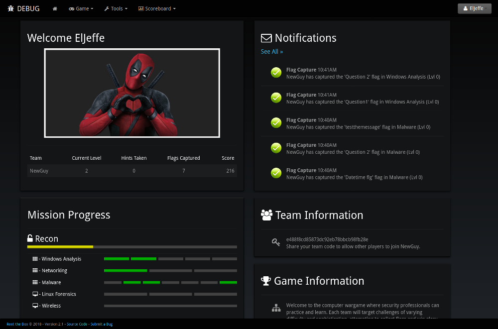

# >_ Root the Box
-------------------
Root the Box is a real-time scoring engine for computer wargames where hackers can practice and learn. The application can be easily configured and modified for any CTF game. Root the Box attempts to engage novice and experienced players alike by combining a fun game-like environment, with realistic challenges that convey knowledge applicable to the real-world, such as penetration testing, incident response, digital forensics and threat hunting. 

Just as in traditional CTF games, each team or player targets challenges of varying difficulty and sophistication, attempting to collect flags. Root the Box brings additional options to the game.  It can be configured to allow the creation of "Botnets" by uploading a small bot program to target machines, which grant periodic rewards with (in-game) money for each bot in the botnet; the larger the botnet the larger the reward.  Money can be used to unlock new levels, buy hints to flags, download a target's source code, or even "SWAT" other players by bribing the (in-game) police.  Player's "bank account passwords" can also be publically displayed by the scoring engine, allowing players to crack each other's passwords and steal each other's money.

Features
-------------
* [Distributed under the Apache License, Version 2.0](http://www.apache.org/licenses/LICENSE-2.0)
* [In-Game Botnets](https://github.com/moloch--/RootTheBox/wiki/Features)
* Team Play or Individual Play
* Real-time scoreboard graphs using websockets
* Real-time status updates using websockets
* Flag Types - Static, Regex, Datetime, Multiple Choice, File (w/options for case senstivity)
* Options for Penalties, Hints, Level Bonuses, Dynamic Scoring, Categories and more
* Built-in team based file/text sharing and Admin game material distirbution
* A wall of sheep displaying cracked passwords
* Unlocks and upgrades as users capture flags
* Export and share Boxes/Flags
* Other cool stuff

Setup
-------------------
See the [Root the Box Wiki](https://github.com/moloch--/RootTheBox/wiki)

Platform Requirements
-------------------------
* [Python 2.7.x](https://www.python.org/) or [Pypy 2.x](http://pypy.org/)
* Install scripts are for [Ubuntu](http://www.ubuntu.com/) (or [Debian](https://www.debian.org/)) but the application should work on any Linux, BSD, or OSX system.
* Internet Explorer is *NOT* supported, any compatability with IE is purely coincidental. Please use the latest release of [Firefox](https://www.mozilla.org/en-US/), [Chrome](https://www.google.com/chrome/), [Opera](http://www.opera.com/), or any other browser that supports open standards.

Avatar Packs
-------------------
* [Marvel User Pack](https://drive.google.com/open?id=100my3UEBXAFDHAAsl-5By5TPk6JrZ1LO}) (pw: rootthebox)
* [Assorted Team Pack](https://drive.google.com/open?id=1aeAeAuNulJVd2w5ADhBlmP1WqdpzDpjz) (pw: rootthebox)

Questions? Problems?
-------------------------------
Open a ticket on GitHub and I'd be happy to help you out with setup/configuration/edits.

Feature Requests
----------------------
Open a ticket on GitHub, and I'll see what I can do for you.  I'm always brainstorming new ideas, and looking for cool stuff to add!
